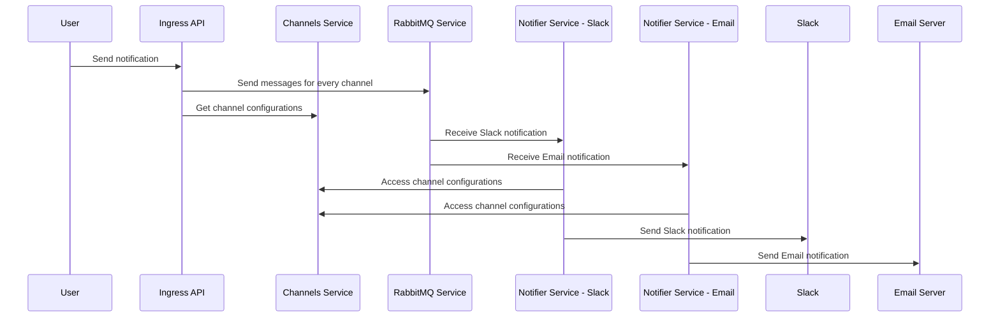

# Notifications Manager

## Overview


## Requirements

- Go `1.22`
- Docker

## Starting up the project

1. Build the docker images
```bash
docker compose build
```

2. Fill the [channels.yaml](channels.yaml) file with the desired channels(for docker compose deploy use the [channels.dev.yaml](channels.dev.yaml) file)

3. Start the services with either docker or k8s
  ### Docker
    ```bash
    docker compose up -d 
    ```
  ### Kubernetes
    
    For this you'll need to add a secret with the channels file
    ```bash
    kubectl create secret generic channels-config-secret --from-file=channels.yaml
    ```
    ```bash
    kubectl apply -R -f deployment/
    ```

## Development
You'll need to install the following tools to generate the proto files and the docs
```bash
go install google.golang.org/protobuf/cmd/protoc-gen-go@latest
go install google.golang.org/grpc/cmd/protoc-gen-go-grpc@latest
go install github.com/swaggo/swag/cmd/swag@latest
```

### Generate proto files
```bash
protoc --go_out=. --go-grpc_out=. api/channels/api.proto
```

### Generate docs
```bash
swag init --dir pkg/ingress/ -g server.go --output pkg/ingress/docs
```

### Launch rabbitmq
```bash
docker compose up -d rabbitmq
```
